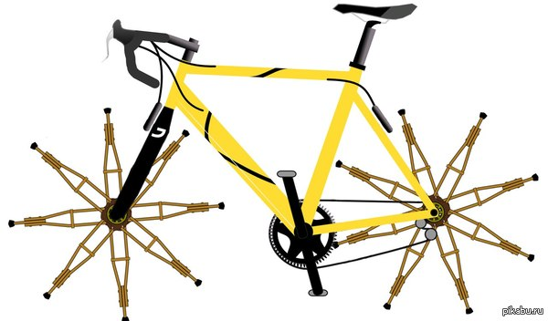

# studyEpam

<strong>Long story short:</strong>

  

Demo
* [One](http://alekseychepurko.github.io/)
* [Two](http://alekseychepurko.github.io/odm.html)

Run:

    npm i
    gulp
    
* Build - Gulp
* Static templates - Pug
* Visual dynamic - VanilaJS
* Content-dynamic - VanilaJS

## [#JS Core](./src/scripts/core)
### [#Async](./src/scripts/core/Async.js)
| Function        | Parameters           | Output  | Description  | 
| --------------- | :---------:| -------:| :-------|
| getJSON         | (string: URL, function: Callback) | Promise | Fetches JSON file from URL => callback(jsonResult)

### [#Classes](./src/scripts/core/classes.js)
| Function        | Parameters       | Output  | Description  | 
| --------------- | :---------:| :-------:| :-------|
| add         | (Node: targetNode, string: classToAdd) | - | Adds classToAdd to the targetNode. If targetNode has classToAdd, then does nothing
| remove         | (Node: targetNode, string: classToRemove) | - | Removes classToRemove from the targetNode. If targetNode has no classToRemove, then does nothing
| toggle         | (Node: targetNode, string: classToToggle) | - | Toggles the classToToggle to the targetNode

### [#Selections](./src/scripts/core/Selections.js)
| Function        | Parameters       | Output  | Description  | 
| --------------- |:---------:| :-------:| :-------|
| select         | (string: selector, Node: element=document) | \[instances of HTMLElements] | Syntactic sugar for (selector, element=document)=> element.querySelectorAll(selector);
| selectFirst         | (string: selector, Node: element=document) | instance of HTMLElement | Syntactic sugar for (selector, element=document)=> element.querySelector(selector)

### [#Strings](./src/scripts/core/Strings.js)
| Function        | Parameters       | Output  | Description  | 
| --------------- | :---------:| :-------:| :-------|
| camalize         | (string: input) | string | Camalizes the input string

### [#Component](./src/scripts/core/Component.js)
#### Description
Basic Component class. Every instance of a class extended from Component has to define render() method

| Field        | Description  | 
|:---------------| :--------------------:|
| parent | Link to the parent element (Component or HTML Node) | 
| children | Array of Components
| props | Object of props. Basic: attributes | 
| props.data | Additional innerHTML of HTMLOject of a corresponding Component element | 
| props.attributes | Object - all fields will be written to the attributes of HTMLOject of a corresponding Component element (including style, class and id) | 
| isRendered | true if element is already rendered | 
| dependentChildren | Array of children who depends on its state | 
| HTMLObject | HTMLElement entity of Component element | 
| numberInParent | Number in parent.children array | 

| Method        | Parameters       | Defaults  | Output  | Description  | 
| --------------- | :---:| :---:| :---:| --------------------:|
|Constructor| (string: type, object: props, instanceOfComponent: parent) | type="fragment", props={}, parent=this  | Creates instance of Component class
| addChildren | (single Component instance or Array) | [] | this | Adds children to the Component instance |
| removeChild | (Number or Component) | - | this.children | Removes child from this.children array according to the position in children array or to the Component instance |
| ComponentWillRender | - | - | - | Lifecycle method. Runs before component renders |
| ComponentDidRender | - | - | - | Lifecycle method. Runs after component rendered |
| ComponentWillUpdate | - | - | - | **Does not wok yet!** Lifecycle method. Runs before component reRender.|
| ComponentDidUpdate | - | - | - | **Does not wok yet!** Lifecycle method. Runs after component reRender. |
| static render| (ComponentInstance: element, ComponentInstance or NodeInstance: destination) | - | destination | Renders element to the destination |